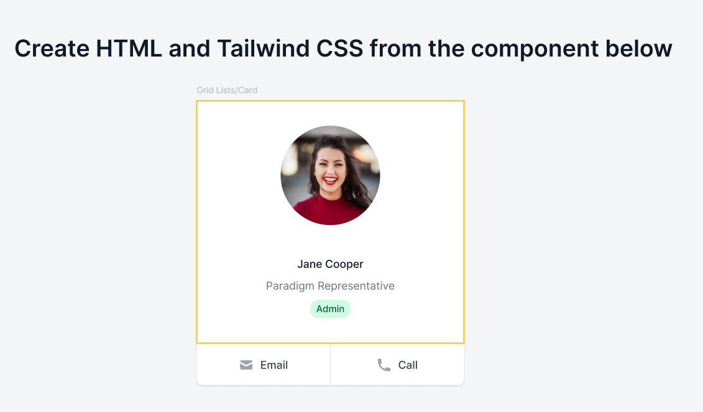

Backend task
1. Create a new GitHub repository.
2. Use Drupal Starter to get Drupal 10 on your local.
3. Install OG module, and configure a new content type called Group as an OG Group.
4. Implement a Pluggable entity view builder (PEVB) plugin to Full view mode of the new Group content type, similar to this example. - 

<?php

namespace Drupal\server_general\Plugin\EntityViewBuilder;

use Drupal\media\MediaInterface;
use Drupal\node\NodeInterface;
use Drupal\server_general\EntityViewBuilder\NodeViewBuilderAbstract;

/**
 * The "Node News" plugin.
 *
 * @EntityViewBuilder(
 *   id = "node.news",
 *   label = @Translation("Node - News"),
 *   description = "Node view builder for News bundle."
 * )
 */
class NodeNews extends NodeViewBuilderAbstract {

  /**
   * Build full view mode.
   *
   * @param array $build
   *   The existing build.
   * @param \Drupal\node\NodeInterface $entity
   *   The entity.
   *
   * @return array
   *   Render array.
   */
  public function buildFull(array $build, NodeInterface $entity) {
    $this->messenger()->addMessage('Add your Node News elements in \Drupal\server_general\Plugin\EntityViewBuilder\NodeNews');

    // Header.
    $build[] = $this->buildHeroHeader($entity, 'field_featured_image');

    // Tags.
    $build[] = $this->buildContentTags($entity);

    // Body.
    $element = $this->buildProcessedText($entity);
    $build[] = $this->wrapElementWideContainer($element);

    return $build;
  }

  /**
   * Default build in "Teaser" view mode.
   *
   * Show nodes as "cards".
   *
   * @param array $build
   *   The existing build.
   * @param \Drupal\node\NodeInterface $entity
   *   The entity.
   *
   * @return array
   *   Render array.
   */
  public function buildTeaser(array $build, NodeInterface $entity) {
    $image_info = $this->getMediaImageAndAlt($entity, 'field_featured_image');

    $element = parent::buildTeaser($build, $entity);
    $element += [
      '#image' => $image_info['url'] ?? NULL,
      '#image_alt' => $image_info['alt'] ?? NULL,
      '#tags' => $this->buildTags($entity),
      '#body' => $this->buildProcessedText($entity),
    ];

    $build[] = $element;

    return $build;
  }

  /**
   * Build card view mode.
   *
   * @param array $build
   *   The existing build.
   * @param \Drupal\node\NodeInterface $entity
   *   The entity.
   *
   * @return array
   *   Render array.
   */
  public function buildCard(array $build, NodeInterface $entity) {
    $media = $this->getReferencedEntityFromField($entity, 'field_featured_image');
    $element = [
      '#theme' => 'server_theme_card',
      '#title' => $entity->label(),
      '#image' => $media instanceof MediaInterface ? $this->buildImageStyle($media, 'large', 'field_media_image') : NULL,
      '#url' => $entity->toUrl(),
      '#body' => $this->buildProcessedText($entity),
    ];
    $build[] = $element;
    return $build;
  }

}

5. Add to the PEVB plugin the following logic: Whenever a registered user will visit the group, it should offer to subscribe that user by greeting them with their name: Hi {{ name }}, click here if you would like to subscribe to this group called {{ label }}. Make sure to use OG’s API to check if the user is allowed to subscribe.
6. Add a test to validate the functionality, like this - 
<?php

namespace Drupal\Tests\server_general\ExistingSite;

use Drupal\taxonomy\Entity\Vocabulary;
use Symfony\Component\HttpFoundation\Response;

/**
 * A model test case using traits from Drupal Test Traits.
 */
class ServerGeneralExampleTest extends ServerGeneralTestBase {

  /**
   * An example test method; note that Drupal API's and Mink are available.
   *
   * @throws \Drupal\Core\Entity\EntityStorageException
   * @throws \Drupal\Core\Entity\EntityMalformedException
   * @throws \Behat\Mink\Exception\ExpectationException
   */
  public function testNews() {
    // Creates a user. Will be automatically cleaned up at the end of the test.
    $author = $this->createUser();

    // Create a taxonomy term. Will be automatically cleaned up at the end of
    // the test.
    $vocab = Vocabulary::load('tags');
    $term = $this->createTerm($vocab);

    // Create a "Llama" article. Will be automatically cleaned up at end of
    // test.
    $node = $this->createNode([
      'title' => 'Llama',
      'type' => 'news',
      'field_tags' => [
        'target_id' => $term->id(),
      ],
      'uid' => $author->id(),
      'moderation_state' => 'published',
    ]);
    $this->assertEquals($author->id(), $node->getOwnerId());

    // We can browse pages.
    $this->drupalGet($node->toUrl());
    $this->assertSession()->statusCodeEquals(Response::HTTP_OK);

    // We can login and browse admin pages.
    $this->drupalLogin($author);
    $this->drupalGet($node->toUrl('edit-form'));
  }

}

7. Create a Pull request on your GitHub repository, with some explanation and images/gif showing the new functionality. Make sure we can install your repo locally and see your work in action.

 Frontend task
7. Continue on the same repo as the Backend task, and head over to this shared Figma file (https://www.figma.com/design/r1kH05IrINkSRPTDGi665K/Home-assignment---TailwindCSS?node-id=1-1180&t=6V2CReIr5JojX0pP-1).
8. Convert the design to Twig using Tailwind, and have it shown under /style-guide as Person card. Make sure you are getting the paddings, margins, font size and colors correct.
9. Add another section showing a grid of 10 Person cards, which is responsive.
Create a Pull request on your GitHub repository, with some explanation and images/gif showing the new functionality. Make sure we can install your repo locally and see your work in action.